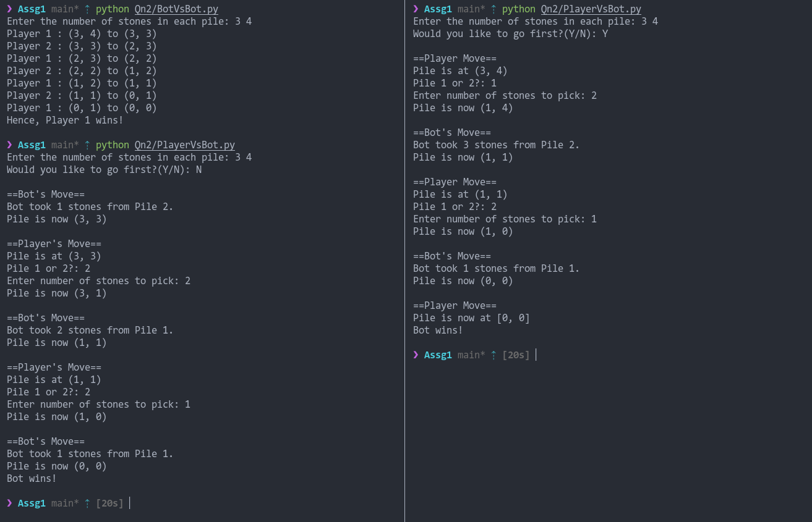
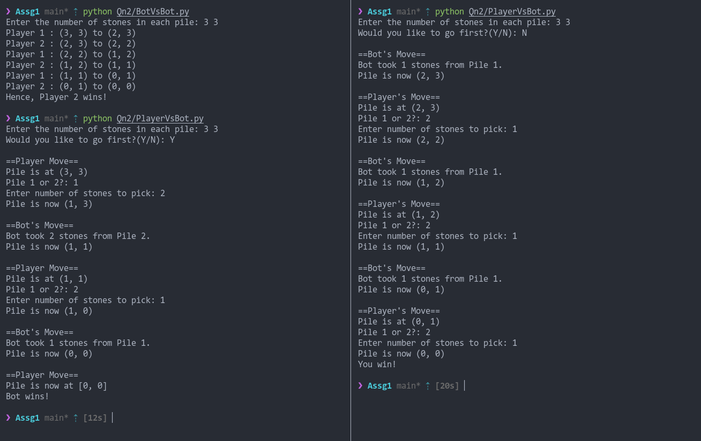
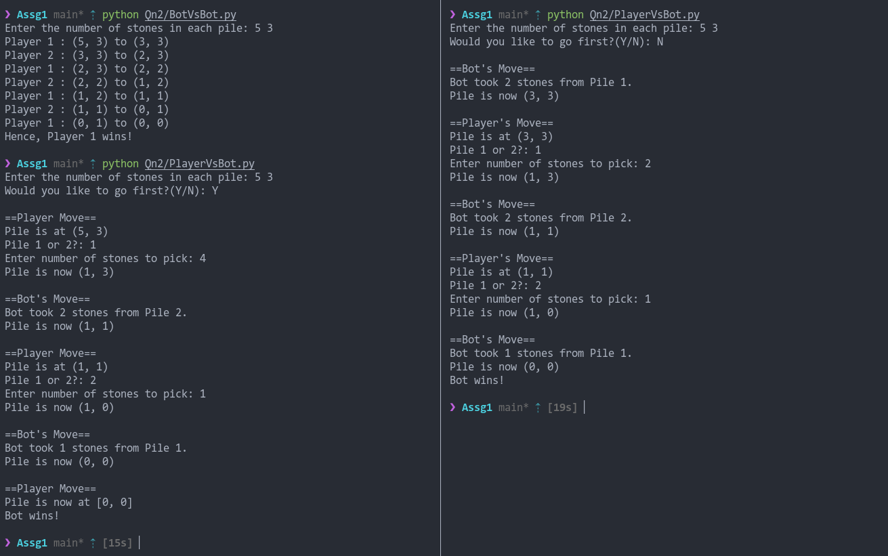
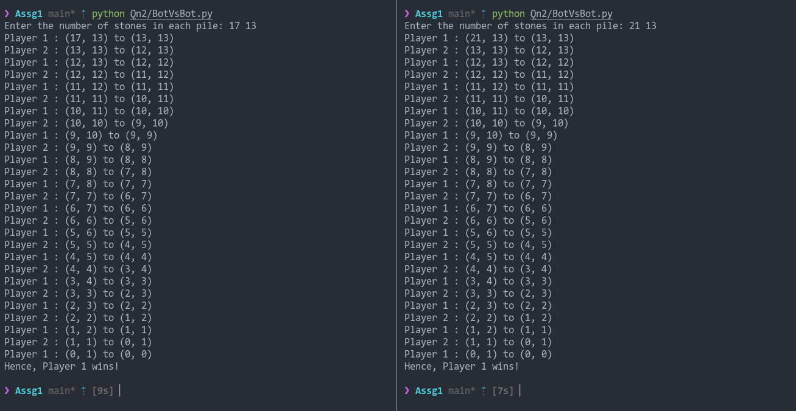
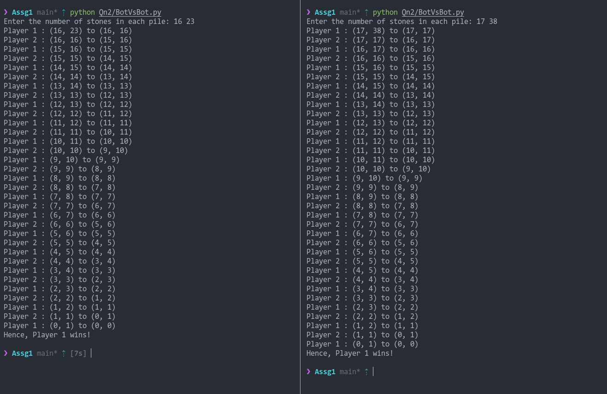

<h1>
    
CS4023D Artificial Intelligence

    
Assignment 1

</h1>

By Dev Sony, B180297CS

The question, report and source code can be found here.
[Github Repo](https://github.com/HotMonkeyWings/AI-Assignment-1)

## Solution 1
We assume the bot can correctly perceive if an area is dirty or not, and it will take either left or right from an area at random. If it moves outside the environment, the bot is restricted from moving. For a set of all assumptions, refer the State Space Search Graph or the Question's pdf.

After running 2 simulations for 1000 timesteps each, these are the results for all possible combinations.

As it is pretty evident, it reaches a saturation point well before 1000 timesteps and hence all iterations would be the same. If the timesteps were less, say 3, the output would be as follows:

### State Space Search Graph

## Solution 2
Here, I've used recursion for the minimax function. The algorithm stores the best paths for each player at each state in pathsTaken[].
In order for readability of code, I've split the Bot vs Bot and Player vs Bot options into two separate files. Both have the same minimax function but different main() functions.

In the first few outputs, I've taken small piles of stones in 3 cases - Bot vs Bot, Player vs Bot and Bot vs Player (in their respective orders.)
The path taken by the winner is displayed in the correct sequence.

#### Output 1

#### Output 2

#### Output 3

Now, due to the time complexity being exponential, I've used the functools.cache() wrapper around the minimax function to help with larger numbers. Here are 4 examples of big piles in a Bot vs Bot scenario. 

#### Output 1

#### Output 2

